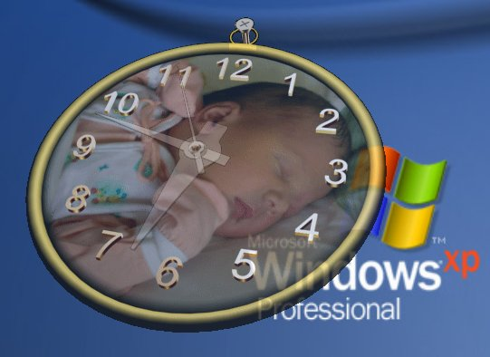



## Ultimate 3D Clock

### Description

A Virtual Clock in 3 dimensions. You choose the backgroud and the opacity.

Use only with Windows XP.
 
### More Info
 

             |
---                |---
**Submitted On**   |2005-07-06 06:35:38
**By**             |[Agustin Rodriguez](https://github.com/Planet-Source-Code/PSCIndex/blob/master/ByAuthor/agustin-rodriguez.md)
**Level**          |Intermediate
**User Rating**    |4.9 (49 globes from 10 users)
**Compatibility**  |VB 6\.0
**Category**       |[Complete Applications](https://github.com/Planet-Source-Code/PSCIndex/blob/master/ByCategory/complete-applications__1-27.md)
**World**          |[Visual Basic](https://github.com/Planet-Source-Code/PSCIndex/blob/master/ByWorld/visual-basic.md)
**Archive File**   |[Ultimate\_3191032772005\.zip](https://github.com/Planet-Source-Code/agustin-rodriguez-ultimate-3d-clock__1-61547/archive/master.zip)

